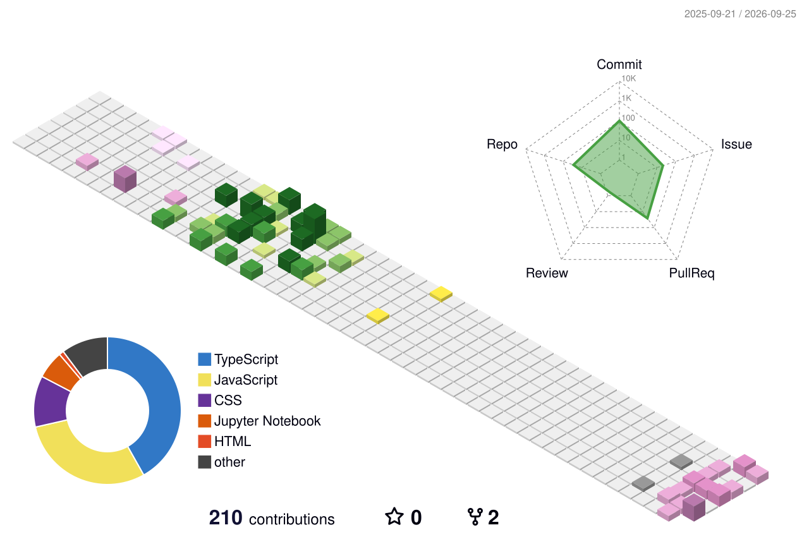

<p align="center">
  <a href="https://github.com/Bar-7150">
    
  </a>
</p>

<p align="center">
  <a href="https://netra-sand.vercel.app"></a>
  <a href="mailto:sunetrabarofficial2025@gmail.com"></a>
  <a href="https://github.com/Bar-7150?tab=repositories"></a>
  
</p>

---

### 👨‍💻 About Me

```yaml
name: Sunetra Bar
institution: Kalyani Government Engineering College (KGEC)
location: Kalyani, West Bengal, India
passions: [Full-Stack Engineering, AI & Deep Learning, Cybersecurity & Ethical Hacking]
portfolio: https://netra-sand.vercel.app
email: sunetrabarofficial2025@gmail.com
```

* 🎓 **Education**: Information Technology student at **Kalyani Government Engineering College (KGEC)**
* 🚀 **Full-Stack Engineering**: Building production-ready, performant applications with **Next.js, React, Node.js, and TypeScript**
* 🧠 **AI & Machine Learning**: Developing deep learning models, computer vision pipelines, and intelligent agentic workflows
* 🛡️ **Cybersecurity & Pentesting**: Passionate about vulnerability assessment, network security scanning, and application security
* 🏆 **Hackathon Builder**: Active participant and builder across hackathons (Smart India Hackathon, Vibe Coding, etc.)
* 💡 **Open-Source Mindset**: Collaborative developer dedicated to building scalable and human-centric software

---

### 🛠️ Tech Stack & Skills

<p align="center">
  <a href="https://skillicons.dev">
    
  </a>
</p>

<p align="center">
  
  
  
  
  
  
  
</p>

---

### 🛡️ Cybersecurity & Penetration Testing

<p align="center">
  <a href="https://skillicons.dev">
    
  </a>
</p>

<p align="center">
  
  
  
  
  
  
  
</p>

* 🔍 **Network Reconnaissance & Vulnerability Assessment**: Port scanning, service enumeration, and script scanning using **Nmap**
* 🌐 **Web Application Security**: Interception, request fuzzing, and manual testing using **Burp Suite**
* 🎯 **Client-Side Exploitation & Research**: Browser hooking and vector analysis with **BeEF Framework**
* 🦈 **Packet Analysis**: Deep packet inspection, traffic stream analysis, and protocol dissection via **Wireshark**
* 🐧 **Security Lab Environment**: Comprehensive security workflows powered by **Kali Linux** & containerized targets in **Docker**

---

### 🚀 Featured Projects

| Project | Type | Description | Tech Stack | Links |
| :--- | :---: | :--- | :--- | :---: |
| 🌾 **KrishirakshaAI** | 👥 **Team Project** | Intelligent agricultural defense platform featuring AI-powered crop pathology detection, severity assessment, and farmer advisory workflows. Built collaboratively as a team project. | `TypeScript` `Python` `AI/ML` `OpenCV` | [Repo](https://github.com/Bar-7150/KrishirakshaAI) |
| 🛰️ **ISRO Analytics Platform** | 🚀 **Solo Project** | Geospatial and satellite data visualization web platform with real-time analytical tools and imagery rendering. | `Next.js` `Python` `AI/ML` `Vercel` | [Demo](https://web-nu-eight-19.vercel.app) • [Repo](https://github.com/Bar-7150/ISRO) |
| 🌐 **College-Nexus** | 🎓 **Campus Hub** | Centralized collegiate networking ecosystem connecting students, notes sharing, events, and academic collaboration. | `React` `Node.js` `Express` `MongoDB` | [Repo](https://github.com/Bar-7150/College-Nexus) |
| 📹 **vertualMeetup** | ⚡ **Real-Time App** | Low-latency peer-to-peer video conferencing application with instant screen sharing and chat. | `JavaScript` `WebRTC` `Socket.io` `Node.js` | [Repo](https://github.com/Bar-7150/vertualMeetup) |
| 🛡️ **Women Safety Emergency App** | 🏆 **Hackathon** | SOS emergency alert application featuring instant live GPS location dispatch and safety tracking. | `React` `Tailwind` `Geolocation API` | [Repo](https://github.com/Bar-7150/Women-Safety-Vibe-coding-hackathon-app) |
| 💼 **Portfolio v2** | 🎨 **Personal** | Highly interactive 3D developer portfolio showcasing projects, experience, and clean design system. | `Next.js` `Three.js` `GSAP` `Tailwind` | [Live Site](https://netra-sand.vercel.app) • [Repo](https://github.com/Bar-7150/portfolioV2) |

---

### 🌍 3D Contribution Calendar (Southern Hemisphere Season)

<p align="center">
  
</p>

---

### 🐍 Contribution Snake Matrix

<p align="center">
  
</p>

---

### 📊 GitHub Activity & Analytics

<p align="center">
  
</p>

<p align="center">
  
  &nbsp;
  
</p>

---

### 📬 Connect With Me

<p align="center">
  <a href="https://netra-sand.vercel.app"></a>
  &nbsp;
  <a href="mailto:sunetrabarofficial2025@gmail.com"></a>
  &nbsp;
  <a href="https://github.com/Bar-7150"></a>
</p>


